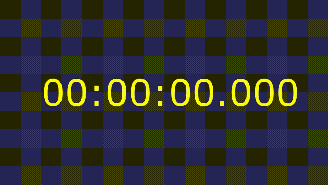

# ffmpeg-slideshow

Génération d'une vidéo de 10 secondes avec `ffmpeg` respectant le scénario suivant :

```
00:00:00 -> 00:00:01 : Ø
00:00:01 -> 00:00:03 : red
00:00:03 -> 00:00:04 : Ø
00:00:04 -> 00:00:05 : white
00:00:05 -> 00:00:06 : Ø
00:00:06 -> 00:00:07 : pink
00:00:07 -> 00:00:08 : Ø
00:00:08 -> fin      : blue
```

## Résultat

```bash
./mk-imgs.sh
./mk-video.sh
mpv output.mp4
```



## Notes

- Ne marche pas sous bash v3 de MacOS -> installer via homebrew `brew install bash` pour avoir bash v5
- dans le scénario, la durée peut être en `s` ou `ms`
- les fichiers doivent avoir le même format de couleurs (ex: `rgba` si `png`)
- pas possible de mixer `jpg` + `png`
- la dernière image est affichée jusqu'à la fin, pas besoin de specifier une `duration`
- testé avec `ffmpeg 7.0.2`

## Ressources

- https://trac.ffmpeg.org/wiki/Slideshow
- https://stackoverflow.com/questions/46952350/ffmpeg-concat-demuxer-with-duration-filter-issue
